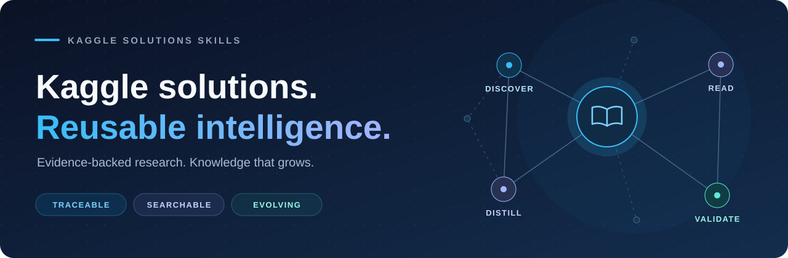
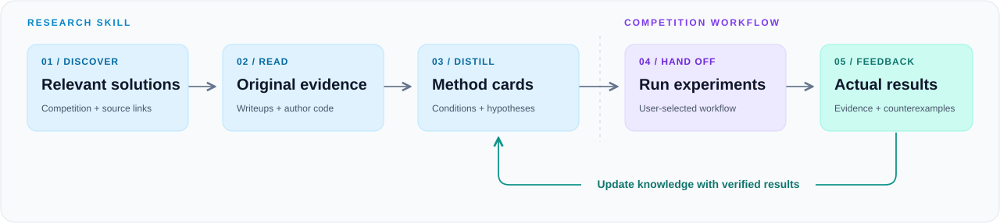
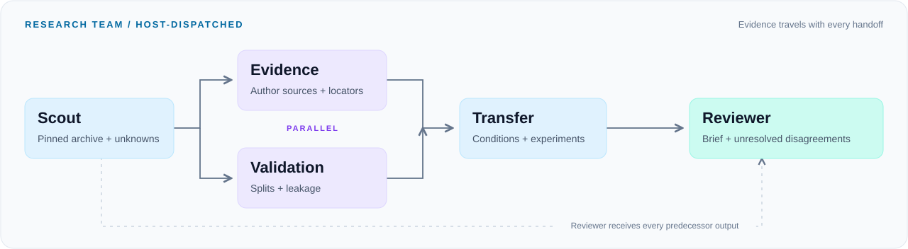

<p align="center">
  
</p>

<h1 align="center">kaggle-solutions-skills</h1>

<p align="center">
  <a href="README.md">English</a> ·
  <strong>简体中文</strong> ·
  <a href="README.ja.md">日本語</a> ·
  <a href="README.zh-TW.md">繁體中文</a>
</p>


<p align="center">
  <strong>从历史解法中找到思路，把真实证据积累成可复用的 Skill。</strong><br>
  离线知识库 · DeepSeek Harness 原生插件 · 多 Agent 研究 · 持续知识审核
</p>

<p align="center">
  <a href="https://github.com/haoxuanjng-lang/kaggle-solutions-skills/releases/tag/v0.2.0"></a>
  <a href="#quick-start"></a>
  <a href="LICENSE"></a>
  <a href="https://github.com/haoxuanjng-lang/kaggle-solutions-skills/actions/workflows/ci.yml"></a>
  <a href="#coverage"></a>
  <a href="#coverage"></a>
  <a href="#deepseek"></a>
  <a href="#scenarios"></a>
</p>

<p align="center">
  <a href="#quick-start">快速开始</a> ·
  <a href="#workflow">工作流程</a> ·
  <a href="#deepseek">DeepSeek 插件</a> ·
  <a href="#team">Agent 协作</a> ·
  <a href="#scenarios">比赛场景</a> ·
  <a href="#coverage">知识覆盖</a> ·
  <a href="docs/examples/rogii-research-brief.md">研究示例</a> ·
  <a href="#maintenance">持续更新</a>
</p>

---

Kaggle 解法散落在论坛、Notebook 和作者仓库里。找到一个冠军链接之后，还需要判断验证方式是否可靠、哪些决定适合当前数据、几个 Agent 的研究如何合并，以及下一场比赛怎样复用这些经验。

本项目以 [faridrashidi/kaggle-solutions](https://github.com/faridrashidi/kaggle-solutions) 为发现索引，把已读作者资料整理成带来源与适用条件的方法卡，并让 Codex 与 DeepSeek Harness 使用同一知识库，交付**相似解法、验证风险和可比较的最小实验**。

| 🔎 找到相关解法 | 🧩 用 Agent 协作研究 | 🌱 积累长期知识 |
| :--- | :--- | :--- |
| 按关键词与模态检索比赛；Codex Skill 与 Harness 原生工具复用同一知识库。 | 侦察、证据、验证、迁移、合成五个角色，传递来源与未知项，保留分歧。 | 经审核更新档案与方法卡；记录实际实验与反例，逐步改进可复用的研究知识。 |

<a id="quick-start"></a>

## ⚡ 快速开始

### 1. 一条命令安装

需要 **Node.js 20+**。从公开 Release 安装完整 Skill，无需 GitHub token：

```powershell
npx --yes --package=https://github.com/haoxuanjng-lang/kaggle-solutions-skills/releases/download/v0.2.0/haoxuanjng-lang-kaggle-solutions-skills-0.2.0.tgz kaggle-solutions-skills install
```

已有安装可追加 `--force` 更新；`--destination <skill-folder>` 可指定目录。

📦 [GitHub Packages](https://github.com/haoxuanjng-lang/kaggle-solutions-skills/packages) · [下载 npm 安装包](https://github.com/haoxuanjng-lang/kaggle-solutions-skills/releases/download/v0.2.0/haoxuanjng-lang-kaggle-solutions-skills-0.2.0.tgz) · [下载 Skill ZIP](https://github.com/haoxuanjng-lang/kaggle-solutions-skills/releases/download/v0.2.0/kaggle-solutions-skills-0.2.0.zip)

完整安装与后续发布说明：[Distribution](docs/distribution.md)。

<details>
<summary><strong>从源码安装 / 使用 GitHub npm registry</strong></summary>

需要 **Python 3.10+**。离线 `search` / `show` / `patterns` 只使用标准库；开发安装会提供更新与校验所需的 PyYAML。

```powershell
git clone https://github.com/haoxuanjng-lang/kaggle-solutions-skills.git
cd kaggle-solutions-skills
python -m pip install -e .
python scripts/project.py install
```

GitHub Packages 的 npm 包为 `@haoxuanjng-lang/kaggle-solutions-skills`，发布在 `npm.pkg.github.com`。按 [GitHub 官方说明](https://docs.github.com/en/packages/working-with-a-github-packages-registry/working-with-the-npm-registry) 完成 registry 认证后：

```powershell
npx --yes --registry=https://npm.pkg.github.com @haoxuanjng-lang/kaggle-solutions-skills@0.2.0 install
```

普通下载与安装可直接使用上方 Release 命令，无需配置 registry。Python 3.10+ 用于运行 Skill 内的研究工具；Node.js 只负责安装文件。

</details>

安装后，在新聊天中调用：

```text
$kaggle-solutions-skills 为这场比赛查找类似问题和解法，提炼有依据的实验方向。
```

### 2. 检索知识

```powershell
# 查看当前档案与研究覆盖
python skills/kaggle-solutions-skills/scripts/solutions.py stats

# 搜索相似问题
python skills/kaggle-solutions-skills/scripts/solutions.py search "医学影像" --modality vision --limit 5

# 查看指定比赛的解法线索
python skills/kaggle-solutions-skills/scripts/solutions.py show rogii-wellbore-geology-prediction --top-rank 5 --json

# 查询可迁移方法
python skills/kaggle-solutions-skills/scripts/solutions.py patterns "蒸馏" --json
```

### 3. 从研究走向实验

| 你想完成的事 | 可以这样调用 |
| :--- | :--- |
| 比较历史方案 | `$kaggle-solutions-skills 比较 OTTO 冠军的候选召回和排序策略，给出最小对照实验。` |
| 沉淀比赛经验 | `$kaggle-solutions-skills 把我这次实验的成功与失败整理为方法卡，保留真实结果。` |
| 更新知识库 | `$kaggle-solutions-skills 更新解法索引，审核上游变化并检查安装版本。` |

📖 [阅读 Skill 入口](skills/kaggle-solutions-skills/SKILL.md) · [查看 ROGII 研究交接示例](docs/examples/rogii-research-brief.md)

<details>
<summary><strong>安装位置与 ZIP 分发</strong></summary>

默认安装到 `$CODEX_HOME/skills/kaggle-solutions-skills`；未设置时为 `~/.codex/skills/kaggle-solutions-skills`。可用 `python scripts/project.py install --destination <skill-folder>` 指定位置。

安装只复制 Skill 及离线知识；缓存、上游 checkout 和私人比赛文件留在源项目。

```powershell
python scripts/project.py package
```

导出 ZIP 包含 Skill、离线知识、MIT 与上游许可，并校验 CRC 和文件字节。也可从 [Releases](https://github.com/haoxuanjng-lang/kaggle-solutions-skills/releases) 获取已发布版本。

</details>

<a id="workflow"></a>

## 🧭 工作流程



| 阶段 | 产出 | 需要保留的依据 |
| :--- | :--- | :--- |
| **检索** | 相似比赛与候选解法 | 比赛、链接、排名线索、上游版本 |
| **阅读** | 原文与代码证据 | 作者表述、代码位置、访问状态 |
| **提炼** | 有条件的方法卡 | 适用前提、失败条件、来源关联 |
| **交接** | 最小对照实验 | 目标假设、验证方式、资源约束 |
| **回流** | 新证据与反例 | 实际结果、运行环境、版本 |

真正训练、运行和取得 Kaggle 官方分数时，将研究结果交给用户选定的比赛 workflow；已有 `agentic-kaggle-skill` 时按它执行。

> **证据边界**：档案链接、作者报告、迁移假设、本地实验和官方分数分别记录。历史排名可以帮助发现解法；目标比赛中的收益需要实际验证。

<a id="deepseek"></a>

## 🐋 DeepSeek Harness 原生插件

### 当前痛点与插件能帮你做的事

| 当前痛点 | 在 Harness 中怎样解决 | 交付什么 |
| :--- | :--- | :--- |
| 找到很多方案，难以判断与当前问题是否相似 | 按问题、模态和历史比赛检索，并查看对应解法线索 | 相似比赛、作者来源和待核实项 |
| 冠军方案里有很多技巧，迁移时容易忽略验证与数据边界 | 查询条件化方法卡，让证据 Agent 与验证 Agent 分别研究 | 适用条件、泄漏风险、失败条件与最小对照 |
| 多 Agent 重复搜索、上下文丢失，汇总时混淆作者报告与实际实验 | 生成独立任务包、依赖图和来源上下文，由 reviewer 合成 | 可交接的研究结果、未解决分歧与实验建议 |

可以让 Harness 为新比赛找相似问题、比较某场比赛的解法、组织研究团队，或将实际实验反馈沉淀成知识。离线检索与任务生成直接可用；新的模型分析沿用你的 Harness 配置，实验与官方成绩由比赛执行 workflow 产生。

同一份 npm 包包含 Cordis 插件、bundle patch、双语元数据和工具图标。已在本机 **Harness `0.1.0-rc.6` 完整 Web host** 中成功调用六个工具，插件管理页显示已挂载、已启用；同时用官方 **`0.2.0-rc.2` 工具运行时** 验证注册、调用、错误传播与卸载。见 [本机验证记录与截图](docs/harness-local-validation.md)。

从 [Release](https://github.com/haoxuanjng-lang/kaggle-solutions-skills/releases/tag/v0.2.0) 下载 `.tgz` 后，在文件所在目录执行：

```bash
npx @deepseek-ai/dsh@0.2.0-rc.2 plugin --profile kaggle add ./haoxuanjng-lang-kaggle-solutions-skills-0.2.0.tgz
npx @deepseek-ai/dsh@0.2.0-rc.2 --profile kaggle --dump-config
```

| 检索工具 | 证据工具 | 协作工具 |
| :--- | :--- | :--- |
| `kaggle_solutions_search` | `kaggle_solutions_show` | `kaggle_research_scenarios` |
| `kaggle_solutions_stats` | `kaggle_solutions_patterns` | `kaggle_research_plan` |

离线工具无需额外 API key；模型对话沿用 Harness 自身配置。插件生成任务包，实际分派使用宿主的 subagent/workflow 能力。官方 Harness 仍处于 developer preview，兼容范围和 workspace 配置见 [插件指南](docs/deepseek-harness.md)。

社区发现：已收录至 [1024Store](https://deepseek1024.com/plugins/haoxuanjng-lang/kaggle-solutions-skills)（[收录 PR 已合并](https://github.com/imsai-sh/awesome-deepseek-harness-plugins/pull/567)）。这是社区目录收录，不代表 DeepSeek 官方认证。安装请使用上方已验证的 Release 包。

<a id="team"></a>

## 🤖 多 Agent 协作研究



```powershell
python skills/kaggle-solutions-skills/scripts/research_team.py plan --scenario otto --output workspaces/otto-research
python skills/kaggle-solutions-skills/scripts/research_team.py validate workspaces/otto-research
```

每个角色拿到独立任务、固定来源上下文、结果契约和前置结果路径。证据阅读与验证审查可以并行；迁移分析等待二者完成，最后由 reviewer 汇总可追溯发现、分歧和最小实验。

在 Codex 中可以直接提出：

```text
$kaggle-solutions-skills 用多 Agent 分析 OTTO 的召回与排序方案，审查验证泄漏，给出最小迁移实验。缺失的目标指标保持未知。
```

**任务包生成 ≠ Agent 已执行。** 宿主实际运行后，通过 `validate <研究目录> --results` 检查角色结果与来源关联。格式通过仍需要研究者判断事实是否得到来源支持。[协作流程](skills/kaggle-solutions-skills/references/multi-agent-research.md) · [实际研究使用说明](docs/examples/team-research.md)

已完成一次 [OTTO 真实研究试用](docs/examples/otto-team-run.md)：五个角色按依赖完成研究，其中 evidence / validation 由独立 Agent 并行执行，审读缓存作者正文后输出迁移实验简报。该记录验证研究流程，尚未验证比赛收益。

<a id="scenarios"></a>

## 🏁 真实比赛研究场景

| 场景 ID | 原比赛 | 研究重点 | 最小实验方向 |
| :--- | :--- | :--- | :--- |
| `otto` | [OTTO](https://www.kaggle.com/competitions/otto-recommender-system) | Session 边界、候选召回与排序 | 固定候选生成，单独比较排序阶段 |
| `birdclef-2024` | [BirdCLEF 2024](https://www.kaggle.com/competitions/birdclef-2024) | 音频上下文、来源质量、伪标签隔离 | 相同 split 和预算下改变一种上下文或伪标签策略 |
| `rogii` | [ROGII](https://www.kaggle.com/competitions/rogii-wellbore-geology-prediction) | 跨井验证、对齐与可靠性路由 | 固定基线，比较单项对齐或路由变化 |
| `amex` | [American Express](https://www.kaggle.com/competitions/amex-default-prediction) | 客户隔离、历史特征与指标对齐 | 保留客户 split，新增一组历史统计特征 |
| `m5` | [M5](https://www.kaggle.com/competitions/m5-forecasting-accuracy) | 预测窗口、递归推理与层级指标 | 相同窗口与训练成本下比较直接/递归预测 |

五个场景关联真实比赛、已记录阅读的作者资料和方法卡，用于研究与协作回归检查。它们是**历史解法研究场景**，没有在本项目中复现冠军训练方案或产生新的官方分数。

```powershell
python skills/kaggle-solutions-skills/scripts/research_team.py scenarios --json
```

<a id="coverage"></a>

## 📚 知识覆盖

**v0.1.0 · 2026-10-04 导入快照**。档案与方法卡徽章及下表均为本版本的固定统计；更新后的实时数量以 `stats` 输出为准。

| 档案索引 | 已阅读资料 | 已审核知识 |
| :--- | :--- | :--- |
| **717** 场比赛 | **13** 篇解法正文 | **21** 张方法卡 |
| **4,724** 条解法链接记录 | **1** 份作者代码 README（Santa 2024） | 作者报告与待验证的迁移假设 |
| **4,708** 个不同 URL | **7** 份 Skill 设计参考文件，来自 **6** 个 GitHub 项目 | 适用条件、失败风险与来源关联 |

部分已读正文只提供局部方法或指向代码；125 场比赛暂无解法链接。上述数量表示档案与研究覆盖，4,708 个 URL 的可访问性、正文阅读和复现状态仍需逐项确认。本项目尚未运行这些冠军训练方案。

<details>
<summary><strong>查看快照来源与可追溯记录</strong></summary>

上游仓库：[faridrashidi/kaggle-solutions](https://github.com/faridrashidi/kaggle-solutions)。

固定上游版本：[`6414951ae88d252a6c92d4489ba389b2b7cb40c7`](https://github.com/faridrashidi/kaggle-solutions/commit/6414951ae88d252a6c92d4489ba389b2b7cb40c7)。

- [本版本验证记录](docs/validation.md)
- [知识字段与证据状态](skills/kaggle-solutions-skills/references/knowledge-schema.md)
- [来源与第三方许可](THIRD_PARTY_NOTICES.md)

</details>

## 📥 读取解法正文

可选择现有浏览器、MCP、官方 CLI，或安装本项目的可选读取依赖：

```powershell
python -m pip install -e ".[kaggle-read]"
python skills/kaggle-solutions-skills/scripts/fetch_source.py https://www.kaggle.com/competitions/birdclef-2024/discussion/512197 --cache cache/sources
```

读取工具使用现有 API token，不打印或写出凭据。Modern writeup 和旧论坛正文分别处理，并验证取得的是原帖。它不提交、不上传、不启动云端 notebook。Kaggle 内部读取接口可能变化；访问失败会留下明确状态，应转到其他读取方式。

<a id="maintenance"></a>

## 🌱 持续更新与知识审核

项目跟踪上游解法档案的变化，经审核后更新索引，并结合作者资料与实际实验证据完善方法卡。项目版本与上游快照分别记录，更新保留已有方法卡，不会自动覆盖已安装的 Skill。

查看 [版本记录](CHANGELOG.md) 和 [Releases](https://github.com/haoxuanjng-lang/kaggle-solutions-skills/releases) 获取更新；已有安装可使用安装命令追加 `--force` 更新。具体维护机制、调度与配置见 [维护文档](docs/daily-maintenance.md)。

### 项目结构

```text
kaggle-solutions-skills/
├── skills/kaggle-solutions-skills/   # 可安装与分发的 Skill
│   ├── SKILL.md                     # Agent 入口与研究流程
│   ├── references/                  # 知识、来源与维护约定
│   └── scripts/                     # 检索、校验与正文读取
├── docs/                           # 示例、路线与验证记录
├── integrations/deepseek-harness/   # 原生插件、bundle 与双语资源
├── config/daily-agent-prompt.md     # 已授权的每日项目维护说明
├── scripts/project.py              # 项目检查、安装与打包
├── tests/                          # 脚本行为检查
└── .github/workflows/               # CI 与上游更新检查
```

## 🤝 参与维护

欢迎补充可追溯的解法资料、方法适用条件、失败案例与实际实验结果。提交前请阅读 [贡献约定](CONTRIBUTING.md) 和 [维护流程](skills/kaggle-solutions-skills/references/maintenance.md)。

| 开始贡献 | 了解方向 | 查看演进 |
| :--- | :--- | :--- |
| [CONTRIBUTING](CONTRIBUTING.md) | [Roadmap](docs/roadmap.md) | [Changelog](CHANGELOG.md) |

---

<p align="center">
  基于 <a href="https://github.com/faridrashidi/kaggle-solutions">Farid Rashidi 的 Kaggle 解法档案</a>，感谢解法作者的公开分享。<br>
  核心代码与新写指令采用 <a href="LICENSE">MIT</a>；上游档案保留原 MIT 许可，链接内容遵循各自许可。<br>
  <sub>独立维护的社区项目 · 非 Kaggle 官方项目</sub>
</p>
